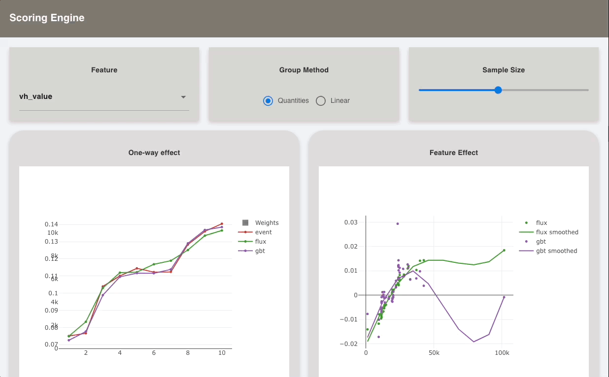

# Scoring Engine App

### Instructions to run the app :- 

1) Download GenieBuilder VSCode Plugin
2) Place the app here `.julia/geniebuilder/apps/`
3) Install dependencies `(ScoringEngineApp) pkg> instantiate`
4) Create a geniebulder new app with same name `ScoringEngineDemo`
