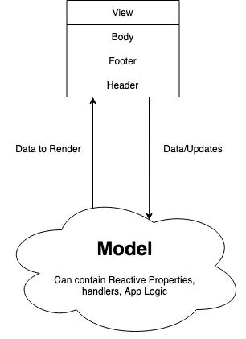
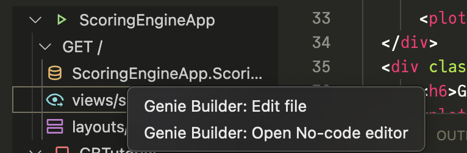
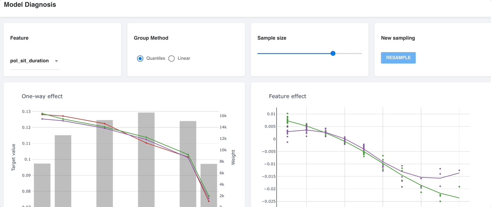
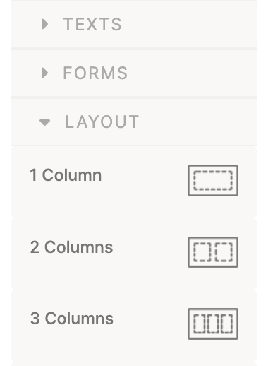
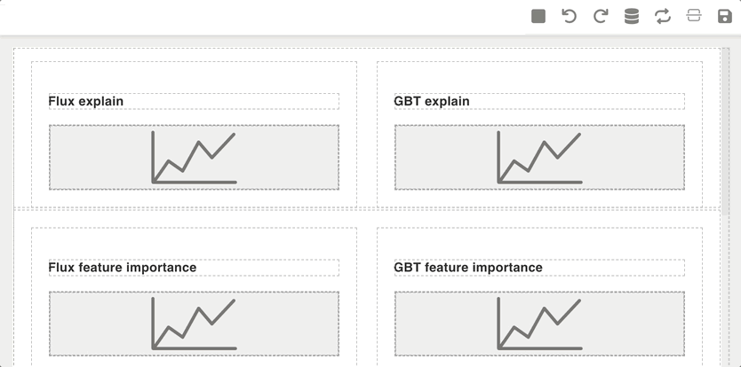

# Scoring Engine App

This GenieBuilder app is a remake of [original project made by Jeremie from Julia Computing](https://github.com/JuliaComputing/ScoringEngineDemo.jl) which is a two video series:


1. End to End Machine Learning Workflow using Julia

[](https://youtu.be/dzChtn9WWT8)

2. Stipple - Building an Interactive App for data exploration and model explanation

[](https://youtu.be/TPbGUbdaRnI)

This project uses Flux MLP & EvoTrees logistics models for data exploration and model explainability

Dataset used from [Insurance Pricing Game](https://www.aicrowd.com/challenges/insurance-pricing-game) challenge

-----

To get started first download Genie Builder for [VSCODE](https://marketplace.visualstudio.com/items?itemName=GenieBuilder.geniebuilder) or [VSCodium](https://open-vsx.org/extension/GenieBuilder/geniebuilder). Please follow the instruction on page to get started.

----

## Building our Project

Create a GenieBuilder project naming `ScoringEngineApp`. The app is created in `.julia/geniebuilder/apps` directory. 

**About GenieBuilder Apps:**

> GenieBuilder will scaffold a GenieApp with boilerplate code. The GenieBuilder App which pre-includes goodies(packages) like Stipple, StipplePlotly, StippleUI, GenieSessions etc.


Once the project is created you can check your app. To run your app in browser `right click` on `GET/` and `Open in browser`

Let's look at the entry point of our application `routes.jl`. As you can see the root `/` route is rendering `hello.jl.html` with layout `app.jl.html` and `model` i.e. brain of application as `AppModel` with model `handlers`

Model and views interaction:

Model mostly contains Data and Logic and it sends data to view for rendering



Let's modify our `models/AppModel.jl` to `ScoringEngine.jl`

```julia
module ScoringEngine

using Stipple, StippleUI, StipplePlotly 

@reactive mutable struct Score <: ReactiveModel
    # reactive properties and data goes here
end


function handlers(model::Score)
    # event handling logic goes here

    return model
end

end
```

We will now change our `hello.jl.html` views to `scoreboard.jl.html`

Change our our app's `route.jl` to use `scoreboard.jl.html` and `ScoringEngine.jl` and it will look like this: 

```julia
using Stipple
using StippleUI
using StipplePlotly

using Stipple.Pages
using Stipple.ModelStorage.Sessions

using ScoringEngineApp
using ScoringEngineApp.ScoringEngine

Page(
    "/",
    view = "views/scoreboard.jl.html",
    layout = "layouts/app.jl.html",
    model = () ->
        ScoringEngineApp.ScoringEngine.Score |> init_from_storage |> ScoringEngine.handlers,
    context = @__MODULE__,
)
```

open no-code editor by **right-clicking** on `views` and click on `open no-code editor`



We will use No-Code Editor to build the layout for our app. Referring to final app it should look like this:



Let's create the layout with `No-Code editor` as shown in above gif

We will drag and drop UI components from **ui component panel** on right



### Create a layout with like below

```
-------------------------------------------
|   h6     |   h6    |   h6    |    h6    |
| select   |  radio  | slider  |  button  |
-------------------------------------------
|        h6          |        h6          |
|   Generic Chart    |    Generic Chart   |
-------------------------------------------
|        h6          |        h6          |
|   Generic Chart    |    Generic Chart   |
-------------------------------------------
|        h6          |        h6          |
|   Generic Chart    |    Generic Chart   |
-------------------------------------------
```

Once you drag-drop all the elements from **UI component panel** on right and connect all the html tags with respective properties for ex. `v-model`, `:data`, `:layout`, `label`, `val`, `:min`, `:max` etc your UI should look like this:



> NOTE: StippleUI uses Quasar. To check how a component works you can look at Quasar Documentation for ex. Radio Component: https://v1.quasar.dev/vue-components/radio

An example of that will be: 

```html
<q-radio v-model="shape" checked-icon="task_alt" unchecked-icon="panorama_fish_eye" val="rectangle" label="Rectangle" />
```

from the example above we can see `q-radio` takes `v-model` and `val` properties

Finally, our `scoreboard.jl.html` will look something like this:

```html
<div class="row">
    <div class="col col-4 col-sm">
        <h6>Feature</h6>
        <q-select :options="features" v-model="feature"></q-select>
    </div>
    <div class="col col-4 col-sm">
        <h6>Group Method</h6>
        <q-radio label="Quantilies" v-model="groupmethod" val="quantiles"></q-radio>
        <q-radio label="Linear" v-model="groupmethod" val="linear"></q-radio>
    </div>
    <div class="col col-4 col-sm">
        <h6>Sample Size</h6>
        <q-slider v-model="sample_size" :min="10" :max="100"></q-slider>
    </div>
    <div class="col col-4 col-sm">
        <h6>New Sampling</h6>
        <q-btn color="secondary" label="RESAMPLE"></q-btn>
    </div>
</div>
<div class="row">
    <div class="col col-6 col-sm">
        <h6>One-way effect</h6>
        <plotly :data="one_way_traces" :layout="one_way_traces"></plotly>
    </div>
    <div class="col col-6 col-sm">
        <h6>Feature Effect</h6>
        <plotly :data="shap_effect_traces" :layout="shap_effect_traces"></plotly>
    </div>
</div>
<div class="row">
    <div class="col col-6 col-sm">
        <h6>Flux explain</h6>
        <plotly :data="explain_flux_traces" :layout="explain_flux_traces"></plotly>
    </div>
    <div class="col col-6 col-sm">
        <h6>GBT explain</h6>
        <plotly :data="explain_gbt_traces" :layout="explain_gbt_traces"></plotly>
    </div>
</div>
<div v-if="isready" class="row">
    <div class="col col-6 col-sm">
        <h6>Flux feature importance</h6>
        <plotly :data="hist_flux_traces" :layout="hist_flux_traces"></plotly>
    </div>
    <div class="col col-6 col-sm">
        <h6>GBT feature importance</h6>
        <plotly :data="hist_gbt_traces" :layout="hist_gbt_traces"></plotly>
    </div>
</div>
```

Now it's time we connect these `v-model` properties to `Reactive Properties` in our `model`

```julia
@reactive mutable struct Score <: ReactiveModel

    features::R{Vector{String}} = features_effect
    feature::R{String} = "vh_value"

    # One-way plots
    groupmethod::R{String} = "quantiles"
    one_way_traces::R{Vector{GenericTrace}} = [PlotlyBase.scatter()]
    one_way_layout::R{PlotlyBase.Layout} = PlotlyBase.Layout()
    one_way_config::R{PlotlyBase.PlotConfig} = PlotlyBase.PlotConfig()

    # plot_layout and config: Plotly specific 
    shap_effect_traces::R{Vector{GenericTrace}} = [PlotlyBase.scatter()]
    shap_effect_layout::R{PlotlyBase.Layout} = PlotlyBase.Layout()
    shap_effect_config::R{PlotlyBase.PlotConfig} = PlotlyBase.PlotConfig()

    # Flux feature importance
    explain_flux_traces::R{Vector{GenericTrace}} = [PlotlyBase.scatter()]
    explain_flux_layout::R{PlotlyBase.Layout} = PlotlyBase.Layout()
    explain_flux_config::R{PlotlyBase.PlotConfig} = PlotlyBase.PlotConfig()

    # GBT feature importance
    explain_gbt_traces::R{Vector{GenericTrace}} = [PlotlyBase.scatter()]
    explain_gbt_layout::R{PlotlyBase.Layout} = PlotlyBase.Layout()
    explain_gbt_config::R{PlotlyBase.PlotConfig} = PlotlyBase.PlotConfig()

    resample::R{Bool} = false
    sample_size::R{Int} = 50
end
```

We need to define `features_effect`

```julia
const features_effect = [
    "pol_no_claims_discount",
    "pol_duration",
    "pol_sit_duration",
    "vh_value",
    "vh_weight",
    "vh_age",
    "population",
    "town_surface_area",
    "drv_age1",
    "drv_age_lic1",
]
```

### Understanding how **html quasar properties** communicates to **model's reactive properties**: 

As browser renders the page a connection between frontend(client-side view) is established with server(over WebSockets if available or using Ajax push/pull if WebSockets are not available)

The **Reactive Properties** here for ex. `features::R{Vector{String}}` is connected to `:options` of `q-select` so when ever we add more string to `features_effect` array the values are reflected in `q-select` dropdown

`v-model` contains "vh_value" by default so whenever we pick one of the item from dropdown `:options` `v-model` is updated and the value is communicted to backend `feature::R{String}`

### Understanding `:data` property: 

`<plotly>` uses `StipplePlotly` to render charts and plot data to frontend. 

* StipplePlotly propvides two APIs to create plots:
 1. struct based API
 2. Interface with PlotlyBase

In this app we will use `PlotlyBase`. Looking at one of **Reactive property of type Plot** we see `GenericTrace`

```shell
julia> using PlotlyBase

(@v1.7) pkg> add PlotlyBase
    Updating registry at `~/.julia/registries/General.toml`
   Resolving package versions...
  No Changes to `~/.julia/environments/v1.7/Project.toml`
  No Changes to `~/.julia/environments/v1.7/Manifest.toml`
Precompiling project...
  8 dependencies successfully precompiled in 26 seconds (183 already precompiled)

julia> using PlotlyBase

julia> PlotlyBase.scatter()
scatter with field type
```

GenericTrace is a way to storing JSON like object in Julia

```js
{
  "type": "scatter",
  "x": [1, 2, 3, 4, 5],
  "y": [1, 6, 3, 6, 1],
  "mode": "markers+text",
  "name": "Team A",
  "text": ["A-1", "A-2", "A-3", "A-4", "A-5"],
  "textposition": "top center",
  "textfont": {
    "family":  "Raleway, sans-serif"
  },
  "marker": { "size": 12 }
}
```

currently `PlotlyBase.scatter()` is empty so have no **field type**


Continuing with our project:

Let's create a directory in `model/scoringengine` and copy paste 5 julia files here:

1. [ScoringEngineDemo.jl](https://github.com/GenieFramework/ScoringEngineApp/blob/master/models/scoringengine/ScoringEngineDemo.jl) :- includes all the methods, definition from `explain.jl`, `model.jl`, `plots.jl`, `preproc-utils.jl` and export them. We will `include` `ScoringEngineDemo.jl` in `models/ScoringEngine.jl` which is where all these definition and methods are used
2. [explain.jl](https://github.com/GenieFramework/ScoringEngineApp/blob/master/models/scoringengine/explain.jl) :-  
    * Defines `plot_shap_importance` which take in a dataframe `df` creates `bar chart object` returns a tuple with _data_ aka _traces_, _layout_ and _config_. 
    * Defines `plot_shap_effect` which takes in a dataframe `shap_effect` and plots `scatter chart object` returns a tuple with _data_ aka _traces_, _layout_ and _config_
    * Defines `plot_shap_explain` which takes in a dataframe `df_explain` and plots `waterfall chart object` returns a tuple with _data_ aka _traces_, _layout_ and _config_
3. [model.jl](https://github.com/GenieFramework/ScoringEngineApp/blob/master/models/scoringengine/model.jl) :- defines `logit` method 
4. [plots.jl](https://github.com/GenieFramework/ScoringEngineApp/blob/master/models/scoringengine/plots.jl) :- 
    * Defines `one_way_plot` which takes in a dataframe `df` creates `scatter chart object` returns a tuple with _data_ aka _traces_, _layout_ and _config_
    * Defines `one_way_plot_weights` which takes in a dataframe `df` creates `bar chart object` returns a tuple with _data_ aka _traces_, _layout_ and _config_
5. [preproc-utils.jl](https://github.com/GenieFramework/ScoringEngineApp/blob/master/models/scoringengine/preproc-utils.jl) :- creates a struct `Preproc` and few other useful methods

and creating an [assets directory](https://github.com/GenieFramework/ScoringEngineApp/tree/master/assets
) which will contain couple of `.bson` and `.csv` files


Also creating an empty file `.autoload_ignore` in `models/scoringengine` directory so all the `.jl` files are ignored and not included/loaded by default when the project loads/starts


Now we can include `models/scoringengine/ScoringEngineDemo.jl` in `ScoringEngine.jl`.

## Understanding handlers [from here](https://github.com/GenieFramework/ScoringEngineApp/blob/d3786408192d972175d6f48bffd82ed58fe52564/models/ScoringEngine.jl#L299-L331) 

```julia
function handlers(model::Score)

    on(model.isready) do _
        one_way_plot!(df_preds, model)
        shap_effect_plot!(df_tot, model)
        shap_explain_plot!(df_tot, model)
    end

    on(model.feature) do _
        one_way_plot!(df_preds, model)
        shap_effect_plot!(df_tot, model)
    end

    on(model.groupmethod) do _
        one_way_plot!(df_preds, model)
    end

    onany(model.sample_size) do (_...)
        shap_effect_plot!(df_tot, model)
        shap_explain_plot!(df_tot, model)
    end

    model
end
```

These handlers are responsible for updating `plots` with revised inference data.

Whenever value `model.feature` / `model.groupmethod` / `model.sample` size is changed, the event handlers are triggered and execute the functions inside them.
